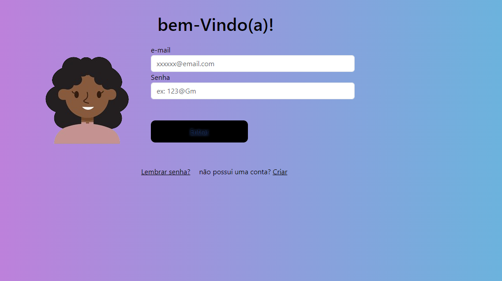
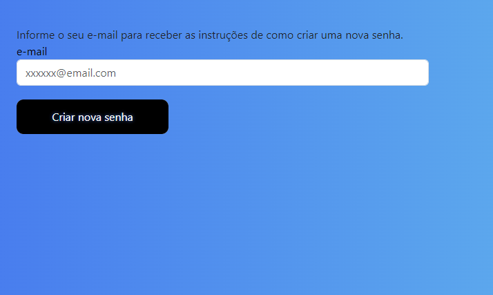

# Projeto Login II 👤


Este é um projeto de página de login simples, é uma atualização projeto criado no ano passado (2023) na aula de desenvolvimento web I, mas utilizando novas tecnicas como: HTML, CSS, Bootstrap e JavaScript. O objetivo deste projeto é fornecer uma interface de login intuitiva e responsiva para os usuários.

# Funcionalidades Principais ❗

Formulário de login com campos para e-mail e senha.
Links para recuperação de senha e criação de conta.
Mensagem de sucesso exibida após o login bem-sucedido.
Tecnologias Utilizadas
HTML: Utilizado para estruturar a página.
CSS: Utilizado para estilizar a página e deixá-la visualmente atraente.
Bootstrap: Framework CSS utilizado para criar um layout responsivo e componentes de interface do usuário.
JavaScript: Possui um arquivo externo "login.js" para adicionar funcionalidades interativas, como validação de formulário.

# Como Utilizar ⁉️

Clone este repositório para o seu computador.
Abra o arquivo "index.html" em seu navegador web.
Preencha os campos de e-mail e senha para fazer login.
Clique no botão "Entrar" para enviar o formulário.
Se o login for bem-sucedido, uma mensagem de sucesso será exibida.
Contribuição
Contribuições são bem-vindas! Se você encontrar bugs ou tiver sugestões de melhorias, sinta-se à vontade para abrir uma issue ou enviar um pull request.

# Autor ✒️
Este projeto foi desenvolvido por Milena Caroline.


# Tecnologias 🛠️
html
css
JavaScript

# Ferramentas 🔧
Vscode
GitHub
Linkedin

# imagens do projeto 🏞️





# Autores ✒️ 

```
https://github.com/MilaKarol
```
```

https://www.linkedin.com/in/milla-karoll
```
